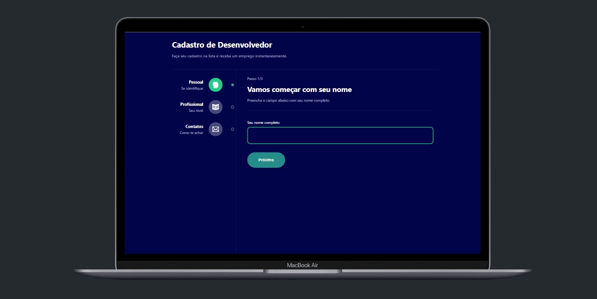

<h1 align="center">Dev Form</h1>

<div align="center">
  
</div>

<p align="center"><a href="https://dev-form-six.vercel.app/">Ver Projeto</a></p>

## 1 - Sobre

O formulário é projetado para coletar informações do usuário em várias etapas, facilitando o processo e tornando-o mais intuitivo.

## 2 - Tecnologias

Um pouco das tecnologias que foram utilizadas no projeto:

- Next JS
- TypeScript
- Tailwind CSS
- Context API
- Cypress

---

## 3 - Rodando o projeto:

Você precisa ter o [Node](https://nodejs.org/en/), o [Git](https://git-scm.com/) e algum gerenciador de pacotes([NPM](https://docs.npmjs.com/downloading-and-installing-node-js-and-npm/) | [Yarn](https://classic.yarnpkg.com/lang/en/docs/install)) instalados em sua máquina.

```bash
1. Clone o repositório:
$ git clone https://github.com/felipems1/dev-form.git

2. Acesse a pasta e instale as dependências via terminal:
$ yarn install / npm install

3. Inicie a aplicação em modo de desenvolvimento:
$ yarn dev / npm run dev

4. O servidor será aberto em http://localhost:3000
```

## 3 - Rodando os testes:

```bash
1. Com o projeto rodando, via terminal execute o comando:
$ yarn test / npm run test
```

<p align="center">Projeto feito com ❤️ por <a href="https://www.linkedin.com/in/felipems1/">Felipe Moises</a></p>
